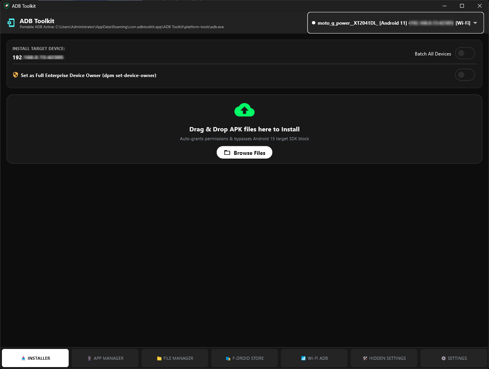
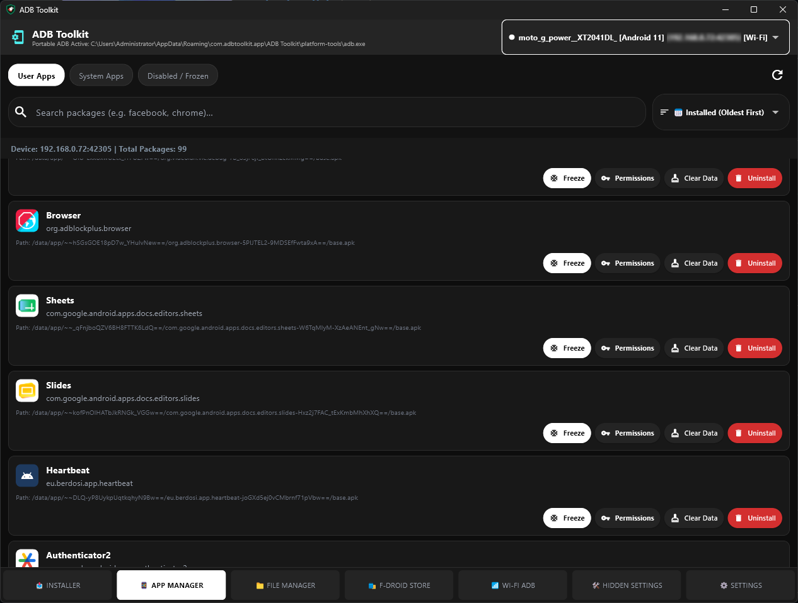
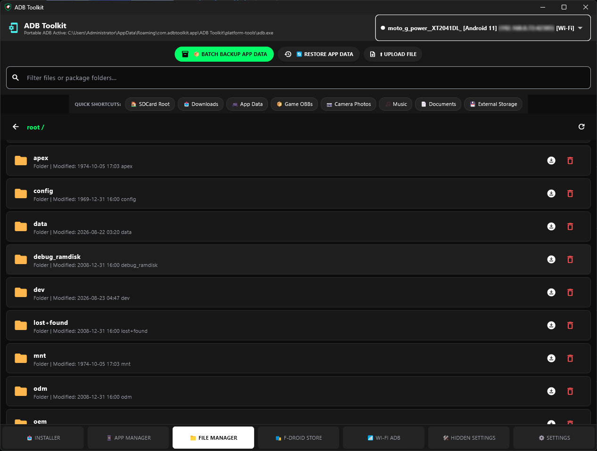
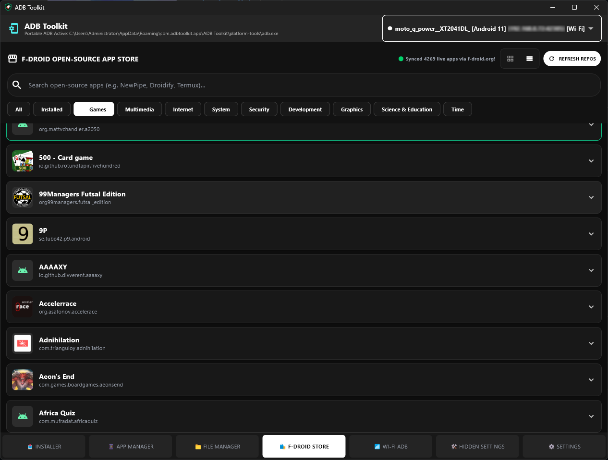
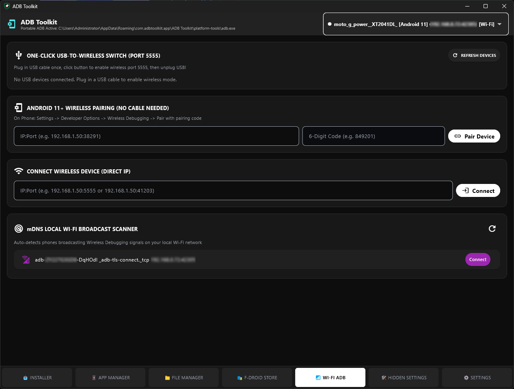
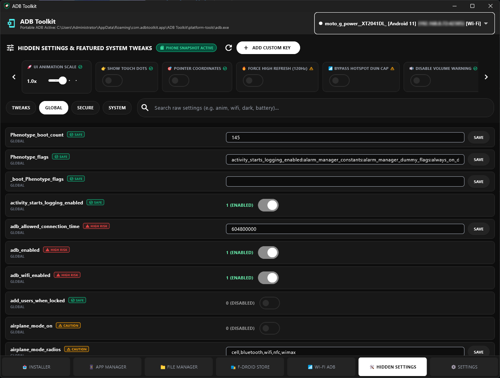
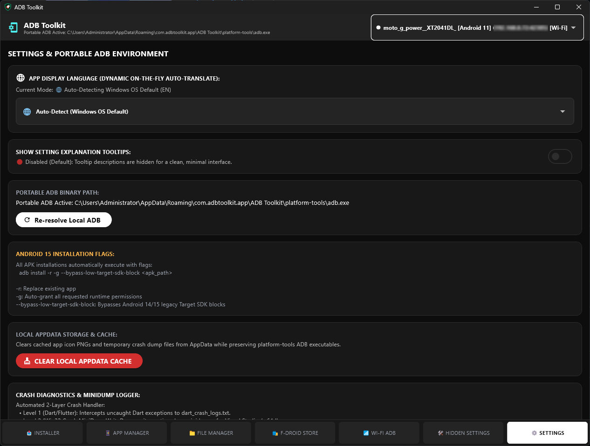

# ADB Toolkit 📱⚡

**ADB Toolkit** is a modern, high-performance Windows Desktop and Web application built with Flutter to manage Android devices via USB and Wireless ADB (Android Debug Bridge). It features a sleek Material 3 dark-themed interface, version-aware Android 14/15 APK installer, full Android file manager, F-Droid open-source app store integration, hidden system settings editor, and wireless pairing tools.

---

## 📸 Application Showcase Gallery

<table>
  <tr>
    <td width="33%" align="center">
      <br>
      <b>1. 📥 Dropzone Installer</b>
    </td>
    <td width="33%" align="center">
      <br>
      <b>2. 📱 App Manager</b>
    </td>
    <td width="33%" align="center">
      <br>
      <b>3. 📁 File Manager</b>
    </td>
  </tr>
  <tr>
    <td width="33%" align="center">
      <br>
      <b>4. 🛍️ F-Droid Store</b>
    </td>
    <td width="33%" align="center">
      <br>
      <b>5. 📶 Wi-Fi ADB Manager</b>
    </td>
    <td width="33%" align="center">
      <br>
      <b>6. 🛠️ Hidden Settings & Tweaks</b>
    </td>
  </tr>
  <tr>
    <td width="33%" align="center">
      <br>
      <b>7. ⚙️ Settings & Diagnostics</b>
    </td>
    <td width="33%" align="center">
      <br><br>
      $$\text{} + \text{} + \text{Flutter} = \text{}$$
      <br><br>
      <b> </b>
    </td>
    <td width="33%" align="center">
      <br>
      <b>ADB Toolkit Suite</b>
    </td>
  </tr>
</table>

---

## 🌟 Comprehensive Feature & Tab Guide

ADB Toolkit is organized into 8 powerful tabs, each designed for specific Android management tasks:

### 1. 📥 Installer (Dropzone Installer)
* **Drag-and-Drop Installation:** Drag `.apk` or `.xapk` files directly into the window or select files via system file picker.
* **Android 10–15 Version-Aware Bypass:** Automatically applies installation flags (`adb install -r -g --bypass-low-target-sdk-block`) to bypass Android 14/15 legacy Target SDK blocks and auto-grant requested runtime permissions.
* **Batch Multi-Device Queueing:** Install multiple APKs concurrently to targeted USB or Wi-Fi connected devices.

### 2. 📱 App Manager
* **Package Explorer:** Browse User Apps, System Packages, and Disabled Applications with real-time search and package name filtering.
* **One-Click Package Actions:**
  * **Uninstall:** Remove user apps or disable system apps cleanly.
  * **Clear Data & Cache:** Instantly reset application storage or free up cache.
  * **Force Stop & Launch:** Start or terminate application processes on the phone.
  * **APK Extraction / Backup:** Extract installed APKs from the Android device directly onto your PC.

### 3. 📁 File Manager
* **Dual-Pane Remote File System:** Navigate `/sdcard/`, `/storage/emulated/0/`, and root directories over ADB.
* **Push & Pull Transfer Engine:** Seamlessly upload local files/folders from PC to phone or download phone files to PC.
* **File Operations:** Create directories, delete files/folders, rename items, and view file sizes and timestamps.

### 4. 🛍️ F-Droid Store Integration
* **Live Open-Source Catalog:** Browse thousands of free, open-source Android apps synced directly from official F-Droid repository mirrors.
* **Category Filtering:** Filter by Multimedia, Games, Internet, System, Security, Development, Navigation, and Science.
* **Flexible Views:** Toggle between **Grid View** and **Column/List View**.
* **Direct 1-Click Install:** Download APKs from F-Droid mirrors and push them straight to your phone over ADB without third-party app stores.

### 5. 📶 Wi-Fi ADB Manager
* **Android 11+ mTLS Pairing:** Pair devices wirelessly using 6-digit PIN codes and dynamic pairing ports.
* **Legacy TCP/IP Mode (Android 10 & below):** Switch connected USB devices to Wireless TCP/IP mode (`adb tcpip 5555`) with one click.
* **Subnet Auto-Scanner:** Automatically scan local Wi-Fi IP ranges for active ADB listeners and reconnect instantly.

### 6. 🛠️ Hidden Settings & Quick Tweaks
* **Database Table Editor:** View, edit, and add custom entries in Android's `global`, `secure`, and `system` database tables (`settings get/put`).
* **Phone Snapshot Baseline & Restore:** Automatically creates an initial baseline backup (`/sdcard/.adb_toolkit_defaults.json`) on the phone to enable 1-click restoration to default values.
* **Featured Quick Tweaks:**
  * **🚀 UI Animation Scale:** Adjust window, transition, and animator scales (0.0x - 2.0x).
  * **👉 Touch Dots & 🎯 Pointer Coordinates:** Toggle visual touch indicators and real-time screen touch overlay.
  * **🔥 Force High Refresh Rate:** Force 90Hz/120Hz display modes (`peak_refresh_rate`).
  * **📶 Bypass Hotspot DUN Cap:** Disguise tethering data traffic (`tether_dun_required`).
  * **🔊 Disable Volume Warnings:** Mute safe-volume headphone warnings (`audio_safe_volume_state`).
  * **🔕 Disable Banner Toasts:** Toggle heads-up notification popups.
  * **🧼 System UI Demo Mode:** Clean status bar for screenshots (`sysui_demo_allowed`).
* **Safety Protection:** Color-coded risk indicators (**Safe**, **Warning**, **Critical**) with safety confirmation popups before applying critical system tweaks.

### 7. ⚙️ Settings & Diagnostics
* **Dynamic On-The-Fly Auto-Translation:** Toggle interface language across multiple languages with dynamic OS auto-detection.
* **Explanation Tooltips:** Toggle detailed descriptive tooltips next to technical Android setting keys.
* **Portable ADB Resolver:** Detects and verifies local portable or system `adb.exe` environment.
* **AppData Cache Cleanup:** Clear cached app icons and temporary files while preserving portable binaries.
* **2-Layer Crash Diagnostics Logger:**
  * **Level 1 (Dart/Flutter):** Intercepts uncaught exceptions to `dart_crash_logs.txt`.
  * **Level 2 (Win32 C++):** Generates native `.dmp` minidumps for debugging.

### 8. 🎨 Theme Creator & Live XML Studio
* **Material 3 Theme Customizer:** Customize dark mode palette tokens (Primary, Secondary, Surface, Background, Accents).
* **Live App Mockup:** Preview UI component colors in real-time.
* **XML Generator:** Export production-ready Android `res/values/colors.xml` resources.

---

## 🛠️ Building & Running Locally

### Prerequisites
* [Flutter SDK 3.13+](https://docs.flutter.dev/get-started/install)
* Windows 10/11 x64 (for Desktop build) or any web browser (for Web build)

### Build Script Orchestration
Run the automated build script to compile both Windows Desktop EXE and Web HTML5 packages:

```powershell
powershell -ExecutionPolicy Bypass -File .\publish.ps1
```

Release artifacts will be packaged into:
* `bin/adbtoolkit-windows-release/adb_toolkit.exe`
* `bin/adbtoolkit-web-release/index.html`
* `bin/theme-creator-windows-release/theme_creator.exe`

---

## 📄 License
Distributed under the GPL-2.0 License with Anti-Tivoization Exception. See `LICENSE` for more information.